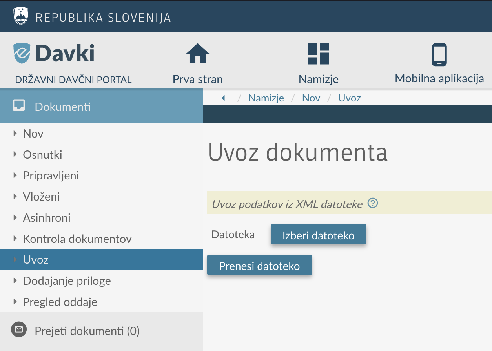

# InteractiveBrokers -> FURS eDavki konverter
_Skripta, ki prevede XML poročilo trgovalnih poslov, dividend in obresti Stock Yield Enhancement programa v platformi InteractiveBrokers v XML format primeren za uvoz v obrazce:_
* _Doh-KDVP - Napoved za odmero dohodnine od dobička od odsvojitve vrednostnih papirjev in drugih deležev ter investicijskih kuponov,_
* _D-IFI - Napoved za odmero davka od dobička od odsvojitve izvedenih finančnih instrumentov in_
* _Doh-Div - Napoved za odmero dohodnine od dividend_
* _Doh-Obr - Napoved za odmero dohodnine od obresti_
_v eDavkih Finančne uprave_

Poleg pretvorbe vrednosti skripta naredi še konverzijo iz tujih valut v EUR po tečaju Banke Slovenije na dan posla.

## Izjava o omejitvi odgovornosti

Davki so resna stvar. Avtor(ji) skripte si prizadevam(o) za natančno in ažurno delovanje skripte in jo tudi sam(i)
uporabljam(o) za napovedi davkov. Kljub temu ne izključujem(o) možnosti napak, ki lahko vodijo v napačno oddajo davčne
napovedi. Za pravilnost davčne napovedi si odgovoren sam in avtor(ji) skripte za njo ne prevzema(mo) nobene odgovornosti.

Če ti je skripta prihranila nekaj ur, nam največ veselja narediš s tem, da nekaj dobička podariš v dober namen. Slikaj priloženo QR kodo s svojo priljubljeno bančno aplikacijo ali klikni na njo:

[](https://www.zpmmoste.net/donatorji/)

## Uporaba

### Namestitev skripte

Na računalniku imej [zadnjo verzijo Python 3](https://www.python.org/downloads/) in [git](https://git-scm.com/downloads).

```
pip install --upgrade git+https://github.com/jamsix/ib-edavki.git
```

```
ib_edavki
```

Odpri datoteko **taxpayer.xml** in vnesi svoje davčne podatke.

### Izvoz poročila v platformi InteractiveBrokers

1. V meniju **Performance & reports** odpri **Flex Queries**
1. Desno od napisa *Activity Flex Query* kliknite *+* za kreiranje novega poročila.
1. Vpiši poljuben **Query Name**
1. Pod **Sections** klikni na **Account Information**. Izberi **IB Entity** in **Account ID** in potem na dnu Save.
1. Pod **Sections** klikni na **Trades**. Pod Options označi **Executions** in **Closed Lots**. Izberi vse vrstice (**Select All**).
1. Pod **Sections** klikni na **Corporate Actions**. Izberi vse vrstice (**Select All**).
1. Pod **Sections** klikni na **Cash Transactions**. Pod Options označi **Dividends**, **Payment in Lieu of Dividends**, **Withholding Tax** in **Broker Interest Received**. Izberi vse vrstice (**Select All**).
1. Pod **Sections** klikni na **Financial Instrument Information**. Izberi vse vrstice (**Select All**).
1. Vse ostale nastavitve pusti tako kot so (datumske nastavitve bomo spreminjali ob zaganjanju poročila).
1. Na dnu klikni **Continue** in nato **Create**, za tem bo treba še enkrat **Ok** in bomo nazaj na oknu **Flex Queries**.
1. V pogledu **Performance & Reports > Flex Queries** se je pod **Activity Flex Query** pojavila nova vrstica s tvojim novim poročilom.
1. Poročilo zaženeš s klikom na puščico v desno poleg imena poročila. Tam sedaj spremeniš **Period** na **Custom Date Range** in spodaj ta rang nastaviš na prvi in zadnji dan leta za katerega generiraš (če katerega od datumov ni možno izbrati, beri spodnjo opombo glede Brexita). Potem samo poženi poročilo in dobiš datoteko.
1. Ponovi postopek za vsako leto trgovanja, če si trgoval v letih 2016, 2017 in 2018, generiraj 3 reporte, po enega za vsako leto. Za pravilen izračun tujega davka na dividende (Withholding Tax) je potrebno generirati tudi report tekočega leta, saj so nekateri obračuni poročani za nazaj.

Ker se je z 2021 zaradi Brexita večino evropskih IBKR računov premaknilo (oziroma realno so se računi ukinili in novi kreirali) iz Londona v eno izmed evropskih podružnic lahko naletiš na težave pri izvozu podatkov. Na strani **Reports** je desno od tega v modrem še številka tvojega računa. Če jo klikneš se odpre meni kjer lahko izbiraš za kateri račun želiš poročila, po defaultu sicer ne kaže ukinjenih računov, vendar če klikneš na filter lahko to spremeniš, da se pokaže tudi ukinjen račun. Potem pa obkljukaš še tistega in klikneš **Continue**. Sedaj boš poleg naslova **Reports** videl dve številki računov, in tudi podatki bodo iz obeh.

### Konverzija IB poročila v popisne liste primerne za uvoz v eDavke

```
ib_edavki [-h] [-y report-year] [-t] ib-xml-file-2021 [ib-xml-file-2020] [ib-xml-file-2019]
```
Kot argument dodaj reporte za vsa leta trgovanja, npr:
```
ib_edavki ib-export-2020.xml ib-export-2021.xml ib-export-2022.xml
```

Skripta po uspešni konverziji v lokalnem direktoriju ustvari štiri datoteke:
* Doh-KDVP.xml (datoteka namenjena uvozu v obrazec Doh-KDVP - Napoved za odmero dohodnine od dobička od odsvojitve vrednostnih papirjev in drugih deležev ter investicijskih kuponov)
* D-IFI.xml (datoteka namenjena uvozu v obrazec D-IFI - Napoved za odmero davka od dobička od odsvojitve izvedenih finančnih instrumentov)
* D-Div.xml (datoteka namenjena uvozu v obrazec D-Div - Napoved za odmero dohodnine od dividend)
* Doh-Obr.xml (datoteka namenjena uvozu v obrazec Doh-Obr - Napoved za odmero dohodnine od obresti)

#### -y <leto> (opcijsko)
Leto za katerega se izdelajo popisni listi. Privzeto trenutno leto.

#### -t (opcijsko)
eDavki ne omogočajo dodajanje popisnih listov za tekoče leto, temveč le za preteklo. Parameter *-t* spremeni datume vseh poslov v preteklo leto, kar omogoča uvoz popisnih listov in **informativni izračun davka** že za tekoče leto. Konverzija iz tuje valute v EUR je kljub temu opravljena na pravi datum posla.

**Pozor: namenjeno informativnemu izračunu, ne oddajaj obrazca napolnjenega s temi podatki!**

#### Dodatni podatki o podjetju za obrazec Doh-Div (opcijsko)
Obrazec Doh-Div zahteva dodatne podatke o podjetju, ki je izplačalo dividende (identifikacijska številka, naslov, ...), ki jih v izvirnih podatkih IBja ni. Ob prvi uporabi, skripta prenese datoteki `companies.xml` in `relief-statement.xml`, ki že vsebujeta nekaj podjetij in sporazumov o izogibanju dvojnega obdavčevanja, ostale lahko dodaš sam, ali manjkajoče podatke po uvozu obrazca vneseš v eDavkih.
*Če boš v `companies.xml` vnesel več novih podjetij, naredi pull request.*

#### Podatki o podružnicah IB za obrazec Doh-Obr
Obrazec Doh-Obr zahteva dodatne podatke o podružnici IB, ki je izplačevalka obresti Stock Yield Enhancement programa (identifikacijska številka, naziv, naslov, država) in jih v izvirnih podatkih IB-ja ni. Ob prvi uporabi skripta prenese datoteko `ib-affiliates.xml`, ki vsebuje zahtevane podatke za IB United Kingdom, IB Central Europe, IB Ireland in IB Luxembourg, po potrebi pa lahko te podatke spremeniš ali dodaš.

### Uvoz v eDavke
>**Pozor**: Obrazec Doh-Div v eDavkih omogoča tudi uvoz podatkov v CSV obliki. `ib-edavki` ne generirajo obrazca Doh-Div v CSV obliki. Namesto uvoza CSV datoteke, se posluži uvoza XML datoteke, kot je opisan zgoraj.

1. V meniju **Dokument** klikni **Uvoz**. Izberi eno izmed generiranih datotek (Doh-KDVP.xml, D-IFI.xml, Doh-Div.xml, Doh-Obr.xml) in jo **Prenesi**.
1. Preveri izpolnjene podatke in dodaj manjkajoče.
1. Pri obrazcih Doh-KDVP in D-IFI je na seznamu popisnih listov po en popisni list za vsak vrednostni papir (ticker).
1. Klikni na ime vrednostnega papirja in odpri popisni list.
1. Klikni **Izračun**.
1. Preveri če vse pridobitve in odsvojitve ustrezajo dejanskim. Zaloga pri zadnjem vnosu mora biti **0**.

ali

1. V meniju **Dokumenti > Nov dokument** izberi obrazec Doh-KDVP (za trgovanje z vrednostnimi papirji na dolgo) ali D-IFI (za trgovanje z vrednostnimi papirji na kratko in trgovanje z izvedenimi finančnimi inštrumenti).
1. Izbira obdobja naj bo lansko leto.
1. Vrsta dokumenta naj bo **O**. Če si za preteklo leto že oddal obrazec, pa želiš le testno narediti izračun davka za tekoče leto, izberi **I**.
1. Izberi **Nov prazen dokument**.
1. Klikni **Uvoz popisnih listov** in izberi ustrezno datoteko (Doh-KDVP.xml za obrazec Doh-KDVP, D-IFI.xml za obrazec D-IFI) in klikni **Uvozi**.
1. Preveri izpolnjene podatke in dodaj manjkajoče.
1. Na seznamu popisnih listov se bo pojavil po en popisni list za vsak vrednostni papir (ticker).
1. Klikni na ime vrednostnega papirja in odpri popisni list.
1. Klikni **Izračun**.
1. Preveri če vse pridobitve in odsvojitve ustrezajo dejanskim. Zaloga pri zadnjem vnosu mora biti **0**.
